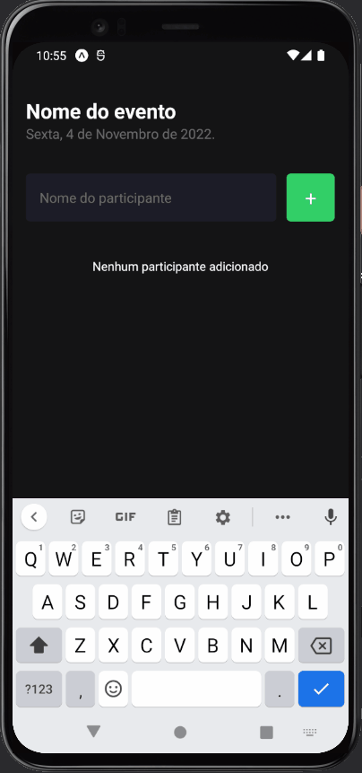

# Aplicativo de Gerenciamento de Participantes

## Descrição

Este é um aplicativo desenvolvido em React Native utilizando TypeScript e StyleSheet. O objetivo principal é gerenciar uma lista de participantes para um evento específico.

## Funcionalidades

1. **Adicionar Participante**: O usuário pode adicionar um novo participante inserindo o nome no campo de texto e clicando no botão `+`.
2. **Remover Participante**: Ao clicar em um participante, o usuário receberá um alerta perguntando se deseja remover o participante da lista.
3. **Visualização de Participantes**: A lista de participantes é exibida na tela principal. Se não houver participantes, uma mensagem informará que nenhum participante foi adicionado.

## Ferramentas e Bibliotecas Utilizadas

- **React Native**: Framework utilizado para desenvolver o aplicativo.
- **TypeScript**: Linguagem de programação que adiciona tipagem estática ao JavaScript.
- **StyleSheet**: Utilizado para estilizar os componentes do aplicativo.

## Estrutura do Código

O código fornecido é um componente chamado `Home`, que representa a tela principal do aplicativo. Aqui está uma breve descrição de suas principais partes:

- **Estado**: Utiliza o hook `useState` para gerenciar a lista de participantes (`participants`) e o nome do participante atualmente inserido (`participantName`).
- **Funções**:
  - `handleParticipantAdd`: Adiciona um novo participante à lista.
  - `handleParticipantRemove`: Remove um participante da lista após confirmação.
- **Renderização**:
  - Exibe o nome e a data do evento.
  - Contém um formulário para inserir o nome do participante e um botão para adicionar.
  - Utiliza o componente `FlatList` para exibir a lista de participantes.
  - Utiliza o componente `Participant` para renderizar cada participante individualmente.

## Como Rodar o Aplicativo

1. Certifique-se de ter o ambiente React Native configurado em sua máquina.
2. Clone o repositório do aplicativo.
3. Navegue até a pasta do projeto e execute `npm install` ou `yarn` para instalar as dependências.
4. Execute `npx react-native run-android` ou `npx react-native run-ios` para iniciar o aplicativo em um emulador ou dispositivo físico.

## Contribuições

Sinta-se à vontade para contribuir com o projeto, abrindo issues ou enviando pull requests.

